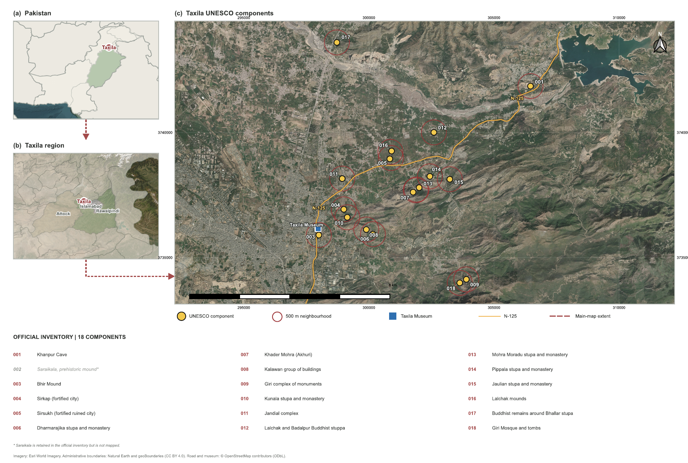

# ProjectTaxila — CHIP / PreserveX

Reproducible research repository for **Climate-contextual landscape-pressure screening and sensitivity-aware field-inspection prioritisation across the Taxila World Heritage property, Pakistan**.

This repository consolidates the executable analysis, frozen evidence package, experiments, results, publication figures, source-traceability records, and LaTeX manuscript prepared for further revision toward submission to the *Journal of Cultural Heritage*.

> **Research status:** private pre-submission working repository. Deterministic and frozen-table checks pass, while the full proxy-model refit remains sensitive to the numerical environment and has not yet reproduced every locked value on Windows. The dated audit records this issue together with the remaining author declarations, permissions, source-version, and journal-formatting actions required before submission.



*Author-approved study-area cartography showing the frozen UNESCO inventory and primary 500 m analytical neighbourhoods. Esri World Imagery provides contextual display only and is not an analytical input; road and museum features are from OpenStreetMap. The circles are sampling supports, not legal or UNESCO buffer boundaries.*

## What the study does

The Climate-contextual Heritage Inspection Prioritisation (CHIP) framework integrates:

- five Landsat epochs from 2004–2024;
- terrain and drainage-related susceptibility derived from SRTM elevation data;
- Open-Meteo ERA5-Seamless and NASA POWER climate context for 1991–2025;
- multiscale component analysis at 250, 500, and 1000 m;
- spatial blocking, ablation, threshold, harmonisation, scale, and weight-sensitivity analyses; and
- a WorldCover-derived proxy-model benchmark.

The output is a **relative field-inspection priority**, not a monument-damage probability, confirmed deterioration map, legal conservation boundary, or causal climate-impact estimate. See [scientific boundaries](data/Taxila_CHIP_Frozen_Evidence_Data/q1_revision/missing_evidence_and_boundaries.md).

## Repository map

| Path | Contents |
| --- | --- |
| [`notebooks/`](notebooks/) | Clean, one-click executable Q1 analysis notebook |
| [`data/Taxila_CHIP_Frozen_Evidence_Data/`](data/Taxila_CHIP_Frozen_Evidence_Data/) | Frozen inputs, processed rasters/vectors, tables, statistics, configurations, validation records, and acquisition scripts |
| [`experiments/integrated/`](experiments/integrated/) | Standalone integrated experiment code, 22 result tables, nine figures, validation records, and rendered analytical deliverables |
| [`manuscript/`](manuscript/) | Modular LaTeX manuscript, Supplementary Information, figures, tables, bibliography, and claim/evidence traceability |
| [`docs/audit/`](docs/audit/) | Manuscript QA, Q1 review-response matrix, and revision history |
| [`scripts/`](scripts/) | Lightweight repository validation utilities |

The exact environment, two execution profiles, evidence-lock rule, and known rerun boundary are documented in [`REPRODUCIBILITY.md`](REPRODUCIBILITY.md).

## Quick start

### 1. Create the Python environment

```bash
python -m venv .venv
source .venv/bin/activate            # Windows: .venv\Scripts\activate
python -m pip install --upgrade pip
python -m pip install -r requirements-reproduction.txt
```

`requirements-reproduction.txt` preserves the claim-critical versions used by the frozen run. `requirements.txt` remains a compatible-range environment for development. The original Linux environment is recorded in [`software_environment.json`](data/Taxila_CHIP_Frozen_Evidence_Data/17_reproducibility/software_environment.json), and the random seed is **311**.

### 2. Run the notebook

Open [`Taxila_CHIP_Q1_Executable_Analysis.ipynb`](notebooks/Taxila_CHIP_Q1_Executable_Analysis.ipynb) from the repository root and choose **Run All**. The notebook automatically detects `data/Taxila_CHIP_Frozen_Evidence_Data/`. It also supports Colab and Kaggle layouts.

For a quick engineering check, set `TAXILA_PROFILE=validation`. Use `TAXILA_PROFILE=publication` for the full stochastic analysis: 50,000 Dirichlet weight draws, 2,000 spatial-block draws per block size, 2,000 point-displacement draws per radius, and 500 spatial states crossed with 10 decision settings. The notebook writes to `Taxila_CHIP_Q1_outputs/`, which is ignored by Git.

### 3. Validate the repository

```bash
python scripts/validate_repository.py
```

### 4. Compile the manuscript

```bash
cd manuscript
chmod +x compile.sh
./compile.sh
```

Compiled PDFs are written to `manuscript/output/` and intentionally ignored by Git. GitHub Actions also compiles the manuscript and makes the PDFs available as temporary workflow artifacts.

## Recorded headline results

- Common 2004–2024 endpoint support: **386,280 cells (95.74%)**.
- Cells meeting at least two adverse spectral criteria: **16.93%**; all three: **1.42%**.
- Highest hierarchical 2024 local priority at 500 m: **Giri complex (0.591)**.
- The development-selected geographically buffered MLP achieved held-out macro-F1 **0.831** (95% block-bootstrap CI 0.700–0.860) on 4,188 samples.
- The clean notebook's deterministic and frozen-table checks pass in the validation profile. Full proxy-model refitting is environment-sensitive and must be compared with the pinned evidence lock before reporting a clean publication reproduction; see the dated scientific audit in [`docs/audit/`](docs/audit/).

These values are tied to the frozen evidence and validation records; they should not be generalized beyond the documented study design.

## Manuscript and submission status

The current source compiles to a 50-page journal-neutral manuscript plus 21-page Supplementary Information, with 91 verified and cited references, 14 main figures, four main tables, four supplementary figures, and seven supplementary tables. It is a strong scientific baseline for the planned *Journal of Cultural Heritage* revision; it is not yet the final publisher-formatted submission. The preserved checkpoint QA report recorded an earlier 48-page count; the current build verification is documented in [`REPOSITORY_VERIFICATION.md`](docs/audit/REPOSITORY_VERIFICATION.md).

Before submission, confirm the complete author list and affiliations, CRediT roles, funding, competing interests, acknowledgements, permissions, and permanent data/code identifiers. The complete checklist is in [`JCH_SUBMISSION_READINESS.md`](docs/JCH_SUBMISSION_READINESS.md).

## Data and licensing

Third-party datasets retain their original provider terms. This repository does not grant a blanket licence over those materials. Provider attribution, source manifests, and limitations are documented in [`LICENSES_AND_ATTRIBUTION.md`](manuscript/LICENSES_AND_ATTRIBUTION.md), [`DATA_AVAILABILITY.md`](DATA_AVAILABILITY.md), and the frozen evidence manifests.

## Citation

Citation metadata are provided in [`CITATION.cff`](CITATION.cff). Replace the pre-submission version and repository identifier when a permanent public release or DOI is created.
